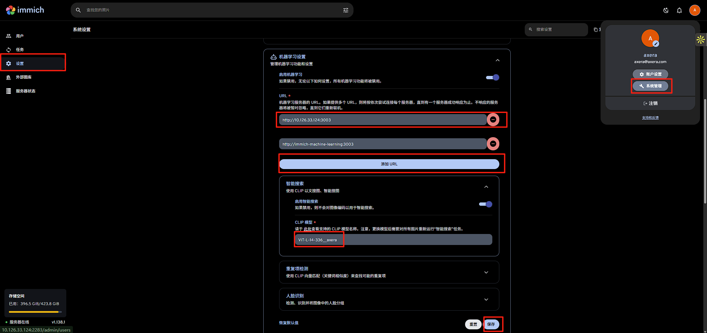
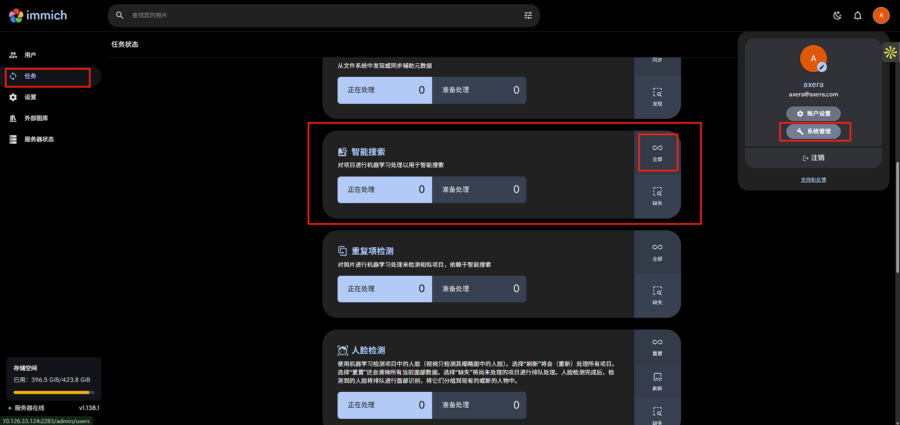

# 先拉官方的镜像(自己设置国内源)
```
cd docker
cp env.example .env
docker compose up -d
docker ps
```

# server 镜像编译（实在不行自己搜一下办法拉个官方镜像然后临时加一下模型列表运行起来也行，自由发挥，也可以试试我打包的x86镜像）
## 添加模型列表 (当前分支我已经改了)
打开 server/src/constants.ts，然后在 `CLIP_MODEL_INFO` 列表里添加 `'ViT-L-14-336__axera': { dimSize: 768 },`

## 编译镜像

先安装依赖
```shell
sudo apt install libcairo2-dev libpango1.0-dev libjpeg-dev libgif-dev librsvg2-dev pkgconfig
```
然后在项目根目录执行编译镜像(这部分自由发挥了能编译成功就行)
```shell
~/immich$ docker build -t ax-immich-server:latest -f server/Dockerfile .
```

## 运行 docker
进入 docker 目录
```
cp example.env .env
docker compose -f docker-compose.yml -f docker-compose.override.yml up -d
```
没什么意外这时候应该跑起来了，并且替换了server镜像，然后访问 http://localhost:2283 就可以看到登录页面了

# ml模块
这部分就不编译生成docker了，不知道怎么在docker访问axcl驱动，所以直接起个http服务

## 下载模型

```
cd ~/.cache/immich_ml/clip
wget https://github.com/ZHEQIUSHUI/immich/releases/download/v0.1/ViT-L-14-336__axera.zip
unzip ViT-L-14-336__axera.zip
```
解压到目录结构应该是这样
```
~/.cache/immich_ml/clip$ tree
.
├── ViT-L-14-336__axera
│   ├── config.json
│   ├── textual
│   │   ├── merges.txt
│   │   ├── model.axmodel
│   │   ├── special_tokens_map.json
│   │   ├── tokenizer_config.json
│   │   ├── tokenizer.json
│   │   └── vocab.json
│   └── visual
│       ├── model.axmodel
│       └── preprocess_cfg.json
```

## 启动 http 服务
```shell
cd machine-learning
pip install -r requirements.txt
python -m immich_ml
```
打印以下日志，就表示对了
```
[08/22/25 10:33:35] INFO     Starting gunicorn 23.0.0                                                                                                                                                                    
[08/22/25 10:33:35] INFO     Listening at: http://[::]:3003 (916005)                                                                                                                                                     
[08/22/25 10:33:35] INFO     Using worker: immich_ml.config.CustomUvicornWorker                                                                                                                                          
[08/22/25 10:33:35] INFO     Booting worker with pid: 916007                                                                                                                                                             
[INFO] Available providers:  ['AXCLRTExecutionProvider']
```
## 进到 immich 的网页，将url添加到系统设置里，大概如下


## 试试行不行

